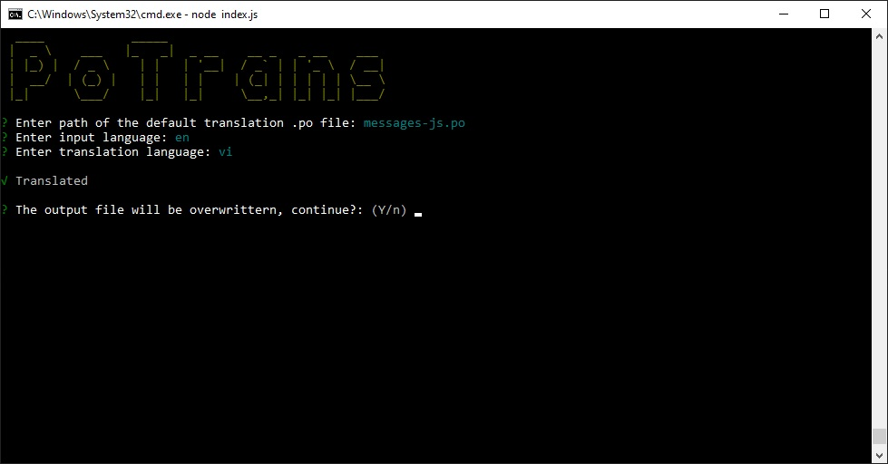

PoTrans is a CLI tool to translate .po/.pot files automatically

Functionality:
- Automatic translation
- Automatic detect input language
- Use Google HTTP API (unlimited and free)

PoTrans uses *Google Translator* service (google-translate-api) to provide automatic translation.
``` code
"https://translate.googleapis.com/translate_a/single?client=gtx&sl=" + sourceLang + "&tl=" + targetLang + "&dt=t&q=" + encodeURI(sourceText);
```

## Install
### Install globally
``` console
$ npm install
```

## Usage
``` console
$ npm start
```

You can also provide optional parameters:
``` console
$ PoTrans -p <InputFile> -l <OutputLanguage>
```
- `<InputFile>` is the path of the .po/.pot file that PoTrans will translate
- `<OutputLanguage>` is the ISO code of the target language that you want that your file will be translated to. 